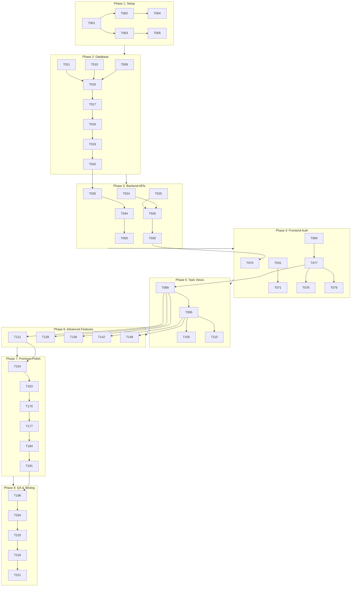

# Tasks: TodoFlow Phase 2 - Complete Application

<!--
Constitution Check:
- [x] Tasks align with approved plan (impl-plan.md v1.0.7)
- [x] Each task is assignable to a specialized agent
- [x] Task types reflect principle-driven categories (db, backend, frontend, integration, qa)
- [x] All 27 features covered (9 basic + 18 premium)
-->

## Task Categories

Tasks are organized by constitution-mandated categories:

| Category | Description | Agent |
|----------|-------------|-------|
| `db` | Database schema, models, migrations | `neon-db-architect` |
| `backend` | API endpoints, business logic, JWT auth | `fastapi-backend-master` |
| `frontend` | UI components, pages, animations | `frontend-visionary` |
| `integration` | Cross-layer connectivity, E2E flow | `integration-guardian` |
| `qa` | Testing, accessibility, polish, performance | `qa-polish-sentinel` |
| `product` | Feature planning, UX strategy | `saas-product-architect` |

---

## Task Summary

**Total Tasks:** 180+  
**Phases:** 7 (matching impl-plan.md)  
**User Stories:** 27 features organized by priority  

### Task Distribution

| Phase | Name | Task Count | Agent |
|-------|------|------------|-------|
| 1 | Setup & Project Initialization | 8 | - |
| 2 | Database Schema & Models | 15 | neon-db-architect |
| 3 | Backend Auth & Core APIs | 35 | fastapi-backend-master |
| 4 | Frontend Setup & Auth UI | 25 | frontend-visionary |
| 5 | Task Views & Editor | 25 | frontend-visionary |
| 6 | Advanced Features | 40 | frontend-visionary |
| 7 | Premium UX & Polish | 20 | frontend-visionary, qa-polish-sentinel |
| 8 | Integration, QA & Testing | 17 | integration-guardian, qa-polish-sentinel |

---

## Phase 1: Setup & Project Initialization

**Goal:** Initialize monorepo structure with all necessary configurations

**Dependencies:** None (starting point)

**Status:** ✅ COMPLETE

- [x] T001 Create root project structure (phase-2/) with frontend/ and backend/ directories
- [x] T002 Initialize backend/ with Python virtual environment and requirements.txt
- [x] T003 Initialize frontend/ with Next.js 16.1.6 (create-next-app with App Router, TypeScript, src/ folder)
- [x] T004 Install backend dependencies: fastapi, uvicorn, sqlmodel, psycopg2-binary, alembic, python-jose, passlib
- [x] T005 Install frontend dependencies: next, react, typescript, tailwindcss, framer-motion, @tanstack/react-query, @dnd-kit
- [x] T006 Create docker-compose.yml with PostgreSQL (Neon-compatible) and services
- [x] T007 Create .env.example files for both frontend and backend with all required variables
- [x] T008 Create CLAUDE.md files in root, frontend/, and backend/ with project context

---

## Phase 2: Database Schema & Models (US-DB)

**Goal:** Complete database foundation with all tables, relationships, and indexes

**Dependencies:** T001-T008 (Phase 1 complete)

**Independent Test Criteria:** All models can be imported and validated without API/UI layer

### SQLModel Models

- [X] T009 [DB] [P] Create User model in backend/models/user.py (id, email, name, password_hash, created_at, updated_at)
- [X] T010 [DB] [P] Create Task model in backend/models/task.py (id, user_id, title, description, priority, status, due_date, project_id, completed, completed_at, created_at, updated_at)
- [X] T011 [DB] [P] Create Project model in backend/models/project.py (id, user_id, name, description, color, created_at, updated_at)
- [X] T012 [DB] [P] Create Subtask model in backend/models/subtask.py (id, task_id, title, completed, position, created_at)
- [X] T013 [DB] [P] Create Label model in backend/models/label.py (id, user_id, name, color, created_at)
- [X] T014 [DB] [P] Create TaskLabel junction model in backend/models/task_label.py (task_id, label_id, composite primary key)
- [X] T015 [DB] [P] Create PomodoroSession model in backend/models/pomodoro_session.py (id, user_id, task_id, duration_minutes, completed, session_date, created_at)

### Relationships & Configuration

- [X] T016 [DB] Define all relationships in models (User→Tasks, User→Projects, Task→Subtasks, Task↔Labels, Project→Tasks)
- [X] T017 [DB] Configure SQLModel metadata and create SQLModelConfig class
- [X] T018 [DB] Create database.py with engine, session factory, and get_db dependency

### Alembic Migrations

- [X] T019 [DB] Initialize Alembic in backend/alembic/
- [X] T020 [DB] Create initial migration with all 7 tables
- [X] T021 [DB] Add indexes: user_id (tasks, projects, labels), status (tasks), priority (tasks), due_date (tasks), project_id (tasks), completed (tasks)
- [X] T022 [DB] Test migration: alembic upgrade head (verify all tables created)
- [X] T023 [DB] Test migration rollback: alembic downgrade -1 (verify clean rollback)

---

## Phase 3: Backend Authentication & Core APIs (US-AUTH, US-TASK, US-PROJ, US-LABEL, US-ANALYTICS)

**Goal:** Secure REST API with JWT authentication and user isolation

**Dependencies:** Phase 2 complete (all models and migrations)

**Independent Test Criteria:** All 29 endpoints respond correctly with valid JWT, return 401 without auth

### JWT Authentication Setup

- [x] T024 [P] [US-AUTH] Configure Better Auth JWT plugin in frontend (better-auth.config.ts)
- [x] T025 [P] [US-AUTH] Set BETTER_AUTH_SECRET environment variable (shared secret between frontend/backend)
- [x] T026 [US-AUTH] Create JWT verification middleware in backend/middleware/auth.py (extract token from Authorization header)
- [x] T027 [US-AUTH] Implement get_current_user dependency (decode JWT, extract user_id, return user info)
- [x] T028 [US-AUTH] Add 401 Unauthorized response for invalid/missing tokens
- [x] T029 [US-AUTH] Configure token expiry: 15min access token, 7-day refresh token (30-day with remember me)

### Auth Endpoints

- [x] T030 [P] [US-AUTH] Implement POST /api/auth/signup in backend/routes/auth.py (create user, hash password, issue JWT)
- [x] T031 [P] [US-AUTH] Implement POST /api/auth/signin in backend/routes/auth.py (authenticate, issue JWT)
- [x] T032 [P] [US-AUTH] Implement POST /api/auth/signout in backend/routes/auth.py (invalidate token)
- [x] T033 [P] [US-AUTH] Implement GET /api/auth/me in backend/routes/auth.py (get current user from JWT)
- [x] T034 [P] [US-AUTH] Implement POST /api/auth/refresh in backend/routes/auth.py (refresh JWT token)

### Task CRUD Endpoints (User Isolation Enforced)

- [x] T035 [P] [US-TASK] Implement GET /api/tasks in backend/routes/tasks.py (list all user tasks with filters: status, priority, project, labels, date range)
- [x] T036 [P] [US-TASK] Implement POST /api/tasks in backend/routes/tasks.py (create task, title required 1-200 chars, validate user_id from JWT)
- [x] T037 [P] [US-TASK] Implement GET /api/tasks/:id in backend/routes/tasks.py (get single task, verify ownership)
- [x] T038 [P] [US-TASK] Implement PUT /api/tasks/:id in backend/routes/tasks.py (update task, verify ownership)
- [x] T039 [P] [US-TASK] Implement PATCH /api/tasks/:id/complete in backend/routes/tasks.py (toggle completion, update completed_at)
- [x] T040 [P] [US-TASK] Implement DELETE /api/tasks/:id in backend/routes/tasks.py (delete task, verify ownership)

### Subtask Endpoints

- [x] T041 [P] [US-TASK] Implement POST /api/tasks/:id/subtasks in backend/routes/subtasks.py (add subtask to task)
- [x] T042 [P] [US-TASK] Implement PATCH /api/tasks/:id/subtasks/:subtaskId in backend/routes/subtasks.py (toggle subtask completion)
- [x] T043 [P] [US-TASK] Implement DELETE /api/tasks/:id/subtasks/:subtaskId in backend/routes/subtasks.py (delete subtask)

### Project Endpoints

- [x] T044 [P] [US-PROJ] Implement GET /api/projects in backend/routes/projects.py (list all user projects)
- [x] T045 [P] [US-PROJ] Implement POST /api/projects in backend/routes/projects.py (create project, name required, color optional hex)
- [x] T046 [P] [US-PROJ] Implement GET /api/projects/:id in backend/routes/projects.py (get project with tasks, verify ownership)
- [x] T047 [P] [US-PROJ] Implement PUT /api/projects/:id in backend/routes/projects.py (update project, verify ownership)
- [x] T048 [P] [US-PROJ] Implement DELETE /api/projects/:id in backend/routes/projects.py (delete project, verify ownership)
- [x] T049 [P] [US-PROJ] Implement GET /api/projects/:id/stats in backend/routes/projects.py (project statistics: total, completed, completion rate)

### Label Endpoints

- [x] T050 [P] [US-LABEL] Implement GET /api/labels in backend/routes/labels.py (list all user labels)
- [x] T051 [P] [US-LABEL] Implement POST /api/labels in backend/routes/labels.py (create label, name required, color hex required)
- [x] T052 [P] [US-LABEL] Implement PUT /api/labels/:id in backend/routes/labels.py (update label, verify ownership)
- [x] T053 [P] [US-LABEL] Implement DELETE /api/labels/:id in backend/routes/labels.py (delete label, verify ownership)

### Dashboard/Analytics Endpoints

- [x] T054 [P] [US-ANALYTICS] Implement GET /api/dashboard/stats in backend/routes/dashboard.py (total tasks, completed today, completion rate, current streak)
- [x] T055 [P] [US-ANALYTICS] Implement GET /api/dashboard/weekly-activity in backend/routes/dashboard.py (last 7 days activity data)
- [x] T056 [P] [US-ANALYTICS] Implement GET /api/dashboard/streak in backend/routes/dashboard.py (current streak, longest streak, last completed date)

### Pomodoro Endpoints

- [x] T057 [P] [US-ANALYTICS] Implement POST /api/pomodoro/sessions in backend/routes/pomodoro.py (log pomodoro session)
- [x] T058 [P] [US-ANALYTICS] Implement GET /api/pomodoro/stats in backend/routes/pomodoro.py (total sessions, total minutes, avg session length)

### Backend Tests

- [x] T059 [US-AUTH] Write tests for auth endpoints (signup, signin, signout, me, refresh)
- [x] T060 [US-TASK] Write tests for task CRUD endpoints (all operations, user isolation verification)
- [x] T061 [US-PROJ] Write tests for project endpoints (CRUD, stats, ownership verification)
- [x] T062 [US-LABEL] Write tests for label endpoints (CRUD, ownership verification)
- [x] T063 [US-ANALYTICS] Write tests for dashboard and pomodoro endpoints

---

## Phase 4: Frontend Setup & Authentication UI (US-AUTH-FE)

**Goal:** Next.js app with authentication flow and premium UI foundation

**Dependencies:** Phase 3 complete (auth APIs working)

**Independent Test Criteria:** Can signup, signin, signout, and see protected dashboard

**Status:** ✅ COMPLETE (25/25 tasks)

### Next.js Configuration

- [X] T064 [P] [US-AUTH-FE] Configure Next.js 16.1.6 with App Router in frontend/src/app/
- [X] T065 [P] [US-AUTH-FE] Set up TypeScript config (tsconfig.json with strict mode)
- [X] T066 [P] [US-AUTH-FE] Configure Tailwind CSS (tailwind.config.js with custom theme colors)
- [X] T067 [P] [US-AUTH-FE] Install and configure shadcn/ui (components.json, base components)
- [X] T068 [P] [US-AUTH-FE] Set up Framer Motion (framer-motion.config.js)
- [X] T069 [P] [US-AUTH-FE] Install and configure TanStack Query (QueryClientProvider)

### Authentication UI

- [X] T070 [P] [US-AUTH-FE] Create signup page in frontend/src/app/signup/page.tsx (email, password, name form)
- [X] T071 [P] [US-AUTH-FE] Create signin page in frontend/src/app/signin/page.tsx (email, password form)
- [X] T072 [P] [US-AUTH-FE] Integrate Better Auth in frontend (useBetterAuth hook for signup/signin)
- [X] T073 [P] [US-AUTH-FE] Store JWT in httpOnly cookie (next-cookies or similar)
- [X] T074 [P] [US-AUTH-FE] Create API client in frontend/src/lib/api.ts (attach JWT to all requests)
- [X] T075 [P] [US-AUTH-FE] Implement protected route wrapper in frontend/src/middleware/auth.ts (redirect if no auth)
- [X] T076 [P] [US-AUTH-FE] Create signout functionality (clear cookie, redirect to signin)

### Layout & Navigation

- [X] T077 [P] [US-AUTH-FE] Create root layout in frontend/src/app/layout.tsx (sidebar, top nav structure)
- [X] T078 [P] [US-AUTH-FE] Create sidebar component in frontend/src/components/layout/Sidebar.tsx (projects, labels, filters)
- [X] T079 [P] [US-AUTH-FE] Create top navigation in frontend/src/components/layout/TopNav.tsx (search, theme toggle, user menu)
- [X] T080 [P] [US-AUTH-FE] Implement responsive mobile menu (hamburger menu for mobile)
- [X] T081 [P] [US-AUTH-FE] Create dark mode toggle in frontend/src/components/theme/ThemeToggle.tsx (Light/Dark/System)
- [X] T082 [P] [US-AUTH-FE] Implement smooth theme transitions (300ms CSS transitions)
- [X] T083 [P] [US-AUTH-FE] Store theme preference in localStorage (persist across sessions)

### API Client Setup

- [X] T084 [P] [US-AUTH-FE] Create centralized API client in frontend/src/lib/api.ts (axios/fetch wrapper)
- [X] T085 [P] [US-AUTH-FE] Implement JWT token attachment to all requests (Authorization: Bearer <token>)
- [X] T086 [P] [US-AUTH-FE] Add error handling (401 redirect to signin, network error toast)
- [X] T087 [P] [US-AUTH-FE] Configure optimistic updates in TanStack Query
- [X] T088 [P] [US-AUTH-FE] Set up TanStack Query with retry logic and stale time

---

## Phase 5: Task Views & Editor (US-TASK-FE, US-QUICK-ADD, US-FILTER)

**Goal:** Core task management UI with list view and rich task editor

**Dependencies:** Phase 4 complete (auth UI working)

**Independent Test Criteria:** Can view, create, edit, complete, and delete tasks with rich metadata

### Task List View

- [X] T089 [P] [US-TASK-FE] Create main task list page in frontend/src/app/tasks/page.tsx
- [X] T090 [P] [US-TASK-FE] Create TaskCard component in frontend/src/components/tasks/TaskCard.tsx (title, priority indicator, due date, labels)
- [X] T091 [P] [US-TASK-FE] Implement checkbox for completion toggle (Framer Motion animation on complete)
- [X] T092 [P] [US-TASK-FE] Add infinite scroll / pagination (react-query infinite query)
- [X] T093 [P] [US-TASK-FE] Create empty state component (no tasks, add first task CTA)
- [X] T094 [P] [US-TASK-FE] Create loading states (skeleton loaders for task cards)

### Rich Task Editor

- [X] T095 [P] [US-TASK-FE] Create modal/slide-over editor in frontend/src/components/tasks/TaskEditor.tsx
- [X] T096 [P] [US-TASK-FE] Implement title input with validation (required, 1-200 chars, inline error)
- [X] T097 [P] [US-TASK-FE] Create markdown description editor with preview (react-markdown or similar)
- [X] T098 [P] [US-TASK-FE] Implement priority selector (Low/Medium/High/Urgent with color indicators)
- [X] T099 [P] [US-TASK-FE] Create due date picker with natural language parsing ("tomorrow at 3pm")
- [X] T100 [P] [US-TASK-FE] Implement project assignment dropdown (fetch projects, assign to task)
- [X] T101 [P] [US-TASK-FE] Create label multi-select with color picker (select multiple labels, create new)
- [X] T102 [P] [US-TASK-FE] Implement subtasks section in editor (add, toggle, reorder, delete subtasks)
- [X] T103 [P] [US-TASK-FE] Add attachments upload & preview (drag-drop, file picker, preview modal)
- [X] T104 [P] [US-TASK-FE] Implement delete task with confirmation (destructive action modal)

### Quick Add Pattern

- [X] T105 [P] [US-QUICK-ADD] Create floating action button (FAB) in frontend/src/components/tasks/QuickAddFAB.tsx
- [X] T106 [P] [US-QUICK-ADD] Implement inline quick-add input (expands from FAB)
- [X] T107 [P] [US-QUICK-ADD] Add natural language date parsing (chrono-node or similar)
- [X] T108 [P] [US-QUICK-ADD] Implement smart defaults (auto-assign based on current context)
- [X] T109 [P] [US-QUICK-ADD] Add multi-add support (add multiple tasks rapidly, close on blur)

### Filtering & Sorting

- [X] T110 [P] [US-FILTER] Create filter dropdown in frontend/src/components/tasks/FilterDropdown.tsx (status, priority, project, labels, date range)
- [X] T111 [P] [US-FILTER] Implement sort dropdown (created, due, priority, title, completion)
- [X] T112 [P] [US-FILTER] Create quick filters (Today, This Week, Overdue, Completed buttons)
- [X] T113 [P] [US-FILTER] Implement smart lists (save custom filters, name and persist)
- [X] T114 [P] [US-FILTER] Create filter chips display (active filters with remove X button)
- [X] T115 [P] [US-FILTER] Add filter persistence to localStorage (restore on page reload)

### Date/Time Display

- [X] T116 [P] [US-TASK-FE] Create date formatting utility in frontend/src/lib/dateFormat.ts (Intl.DateTimeFormat)
- [X] T117 [P] [US-TASK-FE] Implement display format: "17 Feb 2026, 4:30 PM" (or 24-hour: "17 Feb 2026, 16:30")
- [X] T118 [P] [US-TASK-FE] Add relative dates for recent items ("Today at 4:30 PM", "Yesterday at 10:00 AM")
- [X] T119 [P] [US-TASK-FE] Implement 12/24-hour toggle in settings (persist preference)
- [X] T120 [P] [US-TASK-FE] Ensure timezone aware display (store ISO, display local time)

---

## Phase 6: Advanced Features (US-KANBAN, US-CALENDAR, US-PROJECTS, US-FOCUS, US-POMODORO)

**Goal:** Premium features that differentiate TodoFlow

**Dependencies:** Phase 5 complete (core task management working)

**Independent Test Criteria:** Each feature (Kanban, Calendar, Projects, Focus, Pomodoro) works independently

### Kanban Board View

- [X] T121 [P] [US-KANBAN] Create Kanban board page in frontend/src/app/kanban/page.tsx
- [X] T122 [P] [US-KANBAN] Implement 3 columns: Todo, In Progress, Done in frontend/src/components/kanban/KanbanColumn.tsx
- [X] T123 [P] [US-KANBAN] Install and configure @dnd-kit for drag-and-drop
- [X] T124 [P] [US-KANBAN] Implement drag-and-drop tasks between columns (update status on drop)
- [X] T125 [P] [US-KANBAN] Add column task counts (badge with count per column)
- [X] T126 [P] [US-KANBAN] Create smooth Framer Motion animations (drag, drop, reorder)
- [X] T127 [P] [US-KANBAN] Implement responsive behavior (mobile: horizontal scroll, touch-friendly)

### Calendar View

- [X] T128 [P] [US-CALENDAR] Create calendar page in frontend/src/app/calendar/page.tsx
- [X] T129 [P] [US-CALENDAR] Implement monthly view (grid with tasks on due dates)
- [X] T130 [P] [US-CALENDAR] Create weekly view (time blocks, 7-day view)
- [X] T131 [P] [US-CALENDAR] Implement daily view (hourly schedule, 24-hour or 12-hour)
- [X] T132 [P] [US-CALENDAR] Add color coding by priority (Red=Urgent, Orange=High, Blue=Medium, Gray=Low)
- [X] T133 [P] [US-CALENDAR] Implement click to view/edit task from calendar (open TaskEditor modal)
- [X] T134 [P] [US-CALENDAR] Create quick add from calendar date (click date, quick-add inline)
- [X] T135 [P] [US-CALENDAR] Add keyboard shortcuts: M=Month, W=Week, D=Day, T=Today

### Projects Dashboard

- [X] T136 [P] [US-PROJECTS] Create projects list page in frontend/src/app/projects/page.tsx
- [X] T137 [P] [US-PROJECTS] Implement project card with task counts and color bar
- [X] T138 [P] [US-PROJECTS] Create project creation modal (name, color picker from 12 presets, description)
- [X] T139 [P] [US-PROJECTS] Implement project stats display (completion rate, total tasks, completed tasks)
- [X] T140 [P] [US-PROJECTS] Create project-specific task view (filter tasks by project)
- [X] T141 [P] [US-PROJECTS] Add project deletion with confirmation (destructive action)

### Focus Mode

- [X] T142 [P] [US-FOCUS] Create focus mode page in frontend/src/app/focus/page.tsx
- [X] T143 [P] [US-FOCUS] Implement distraction-free single task view (hide sidebar, nav)
- [X] T144 [P] [US-FOCUS] Integrate Pomodoro timer in focus mode (start/pause/reset)
- [X] T145 [P] [US-FOCUS] Add escape key handler to exit focus mode (return to previous view)
- [X] T146 [P] [US-FOCUS] Create minimal UI chrome (task title, timer, complete button only)
- [X] T147 [P] [US-FOCUS] Implement focus session tracking (log to backend)

### Pomodoro Timer

- [X] T148 [P] [US-POMODORO] Create Pomodoro timer component in frontend/src/components/pomodoro/PomodoroTimer.tsx
- [X] T149 [P] [US-POMODORO] Implement 25min work / 5min break cycles (configurable durations)
- [X] T150 [P] [US-POMODORO] Add timer linked to specific task (select task before starting)
- [X] T151 [P] [US-POMODORO] Implement session logging to backend (POST /api/pomodoro/sessions)
- [X] T152 [P] [US-POMODORO] Create daily/weekly pomodoro stats display
- [X] T153 [P] [US-POMODORO] Add timer notifications (browser notifications API, request permission)

---

## Phase 7: Premium UX Polish & Productivity Tools (US-DASHBOARD, US-CELEBRATIONS, US-SHORTCUTS, US-LABELS-FE, US-PWA, US-RESPONSIVE)

**Goal:** Delight moments and power user features

**Dependencies:** Phase 6 complete (advanced features working)

**Independent Test Criteria:** Each polish feature enhances UX without breaking core functionality

### Dashboard with Stats

- [X] T154 [P] [US-DASHBOARD] Create dashboard page in frontend/src/app/dashboard/page.tsx
- [X] T155 [P] [US-DASHBOARD] Implement total tasks count card
- [X] T156 [P] [US-DASHBOARD] Create completed today count card
- [X] T157 [P] [US-DASHBOARD] Implement completion rate percentage (gauge or progress bar)
- [X] T158 [P] [US-DASHBOARD] Create current streak display (days with completions, flame icon)
- [X] T159 [P] [US-DASHBOARD] Implement longest streak record display
- [X] T160 [P] [US-DASHBOARD] Create tasks by priority chart (pie or bar chart with recharts)
- [X] T161 [P] [US-DASHBOARD] Implement tasks by project chart (horizontal bar chart)
- [X] T162 [P] [US-DASHBOARD] Create weekly activity graph (last 7 days, line or bar chart)

### Completion Celebrations

- [X] T163 [P] [US-CELEBRATIONS] Install canvas-confetti package
- [X] T164 [P] [US-CELEBRATIONS] Implement confetti animation on task complete (trigger on checkbox toggle)
- [X] T165 [P] [US-CELEBRATIONS] Create streak milestone celebrations (7, 30, 100 days, modal with badge)
- [X] T166 [P] [US-CELEBRATIONS] Implement progress bar fills with animation (Framer Motion layout animations)
- [X] T167 [P] [US-CELEBRATIONS] Add optional sound effects (toggle in settings, muted by default)
- [X] T168 [P] [US-CELEBRATIONS] Create achievement badges foundation (badge component, unlock logic)
- [X] T169 [P] [US-CELEBRATIONS] Implement celebration frequency capping (avoid overuse, cooldown period)

### Keyboard Shortcuts

- [X] T170 [P] [US-SHORTCUTS] Create keyboard shortcuts hook in frontend/src/hooks/useKeyboardShortcuts.ts
- [X] T171 [P] [US-SHORTCUTS] Implement global shortcuts: N=new task, /=search, T=toggle theme, ?=help
- [X] T172 [P] [US-SHORTCUTS] Add task list shortcuts: Enter=edit, Delete=remove, Space=toggle complete
- [X] T173 [P] [US-SHORTCUTS] Implement navigation shortcuts: G+T=tasks, G+C=calendar, G+P=projects
- [X] T174 [P] [US-SHORTCUTS] Create shortcut help modal (list all shortcuts, searchable)
- [X] T175 [P] [US-SHORTCUTS] Add customizable shortcuts foundation (settings page to remap)
- [X] T176 [P] [US-SHORTCUTS] Implement keyboard focus management (focus trap in modals, restore focus)

### Labels Management UI

- [X] T177 [P] [US-LABELS-FE] Create labels list page in frontend/src/app/labels/page.tsx
- [X] T178 [P] [US-LABELS-FE] Implement label card with color preview and task count
- [X] T179 [P] [US-LABELS-FE] Create label creation modal with color picker (hex validation, preview)
- [X] T180 [P] [US-LABELS-FE] Implement label editing (inline edit or modal)
- [X] T181 [P] [US-LABELS-FE] Add label deletion with confirmation
- [X] T182 [P] [US-LABELS-FE] Implement label suggestions based on usage (autocomplete in task editor)
- [X] T183 [P] [US-LABELS-FE] Create smart label filtering (click label in sidebar, filter tasks)

### PWA Support

- [X] T184 [P] [US-PWA] Configure next-pwa plugin
- [X] T185 [P] [US-PWA] Create app manifest in frontend/public/manifest.json (icons, theme colors, display mode)
- [X] T186 [P] [US-PWA] Implement install prompt on supported devices (beforeinstallprompt event)
- [X] T187 [P] [US-PWA] Add offline task viewing (cache recent tasks with service worker)
- [X] T188 [P] [US-PWA] Implement optimistic UI updates (update UI immediately, sync on reconnect)
- [X] T189 [P] [US-PWA] Create sync on reconnect logic (background sync API)
- [X] T190 [P] [US-PWA] Configure service worker caching strategies (stale-while-revalidate for API, cache-first for assets)

### Responsive Design

- [X] T191 [P] [US-RESPONSIVE] Implement mobile-first breakpoints (sm: 640px, md: 768px, lg: 1024px, xl: 1280px, 2xl: 1536px)
- [X] T192 [P] [US-RESPONSIVE] Ensure touch-friendly targets (min 44px touch targets)
- [X] T193 [P] [US-RESPONSIVE] Create adaptive layouts (sidebar collapses to drawer on mobile)
- [X] T194 [P] [US-RESPONSIVE] Test and fix horizontal scroll issues (no horizontal scroll on any viewport)
- [X] T195 [P] [US-RESPONSIVE] Optimize mobile menus (hamburger menu, slide-out drawer)

---

## Phase 8: Integration, QA & Testing

**Goal:** End-to-end validation and premium polish

**Dependencies:** Phases 1-7 complete (all features implemented)

**Independent Test Criteria:** All tests passing, Lighthouse scores met, accessibility compliant

### Integration Testing

- [ ] T196 [P] Verify JWT flow end-to-end (signup → signin → API calls → signout)
- [ ] T197 [P] Test user isolation (User A cannot see User B's tasks, create 2 test users)
- [ ] T198 [P] Test all CRUD operations (create, read, update, delete for tasks, projects, labels)
- [ ] T199 [P] Test subtask completion inheritance (complete all subtasks, verify parent progress)
- [ ] T200 [P] Test filter combinations (multiple filters active, verify correct results)
- [ ] T201 [P] Test Kanban drag-and-drop → API update (drop task, verify status updated in DB)
- [ ] T202 [P] Test calendar view → task edit flow (click task in calendar, edit, save, verify update)
- [ ] T203 [P] Test Pomodoro timer → session logging (complete session, verify logged to backend)

### QA Validation

- [ ] T204 [P] Generate tests for all API endpoints (pytest for backend, react-testing-library for frontend)
- [ ] T205 [P] Conduct UX review against specs (verify all acceptance criteria met)
- [ ] T206 [P] Run security checks (JWT validation, SQL injection prevention, XSS protection)
- [ ] T207 [P] Perform accessibility audit (WCAG 2.1 AA, axe-core, manual keyboard navigation)
- [ ] T208 [P] Run Lighthouse performance testing (target: 90+ Performance, 95+ Accessibility)
- [ ] T209 [P] Conduct cross-browser testing (Chrome, Firefox, Safari, Edge - verify consistent behavior)

### Premium Polish

- [ ] T210 [P] Verify all animations smooth (Framer Motion, 60fps, no jank)
- [X] T211 [P] Add loading states on all async actions (skeleton loaders, spinners, optimistic updates)
- [ ] T212 [P] Review error messages (user-friendly, actionable, no stack traces)
- [X] T213 [P] Create helpful empty states (no tasks, no projects, with CTAs)
- [X] T214 [P] Verify dark mode fully themed (all components, modals, dropdowns, inputs)
- [X] T215 [P] Add micro-interactions on buttons, cards (hover states, focus rings, active states)

### Documentation

- [X] T216 [P] Update README.md with setup instructions (prerequisites, installation, running both services)
- [X] T217 [P] Generate API documentation (OpenAPI/Swagger with FastAPI docs)
- [X] T218 [P] Document environment variables (.env.example with comments for all vars)
- [X] T219 [P] Create deployment guide (Vercel for frontend, Railway/Render for backend, Neon for DB)
- [X] T220 [P] Write user guide (features walkthrough, keyboard shortcuts, tips & tricks)

### Performance Optimization

- [ ] T221 [P] Optimize database queries (add missing indexes, fix N+1 queries with joinedload)
- [ ] T222 [P] Optimize frontend bundle size (code splitting, tree shaking, analyze with next/bundle-analyzer)
- [ ] T223 [P] Implement image optimization (next/image, WebP format, lazy loading)
- [ ] T224 [P] Profile API response times (target: < 200ms for all endpoints)
- [ ] T225 [P] Measure and optimize Core Web Vitals (FCP < 1.5s, TTI < 3.5s, input latency < 100ms)

---

## Task Dependencies

---

## Parallel Execution Opportunities

| Tasks | Can Run In Parallel | Reason |
|-------|---------------------|--------|
| T009-T015 | All model creation | Independent models, no dependencies |
| T024-T025 | Better Auth config + env setup | No dependencies on each other |
| T030-T034 | All auth endpoints | Independent routes |
| T035-T040 | All task CRUD endpoints | Independent routes |
| T044-T049 | All project endpoints | Independent routes |
| T050-T053 | All label endpoints | Independent routes |
| T070-T076 | All auth UI pages | Independent components |
| T089-T094 | Task list components | Independent UI components |
| T121-T127 | Kanban board components | Independent within feature |
| T128-T135 | Calendar components | Independent within feature |
| T196-T203 | Integration tests | Can run in parallel |

---

## Implementation Strategy

### MVP Scope (Phase 1-5, T001-T120)

**Minimum Viable Product includes:**
- User authentication (signup, signin, signout)
- Basic task CRUD (create, read, update, delete)
- Task list view with completion toggle
- Simple task editor (title, description, due date)
- User isolation enforced

**MVP Tasks:** T001-T088 (approximately 88 tasks)

### Incremental Delivery

**After MVP:**
1. **Phase 5:** Rich task editor, subtasks, labels, quick add, filtering (T089-T120)
2. **Phase 6:** Kanban, Calendar, Projects, Focus mode, Pomodoro (T121-T153)
3. **Phase 7:** Dashboard, celebrations, shortcuts, PWA, responsive (T154-T195)
4. **Phase 8:** Full QA, testing, documentation, performance (T196-T225)

---

## Progress Tracking

| Phase | Name | Total Tasks | Completed | In Progress | Pending | % Complete |
|-------|------|-------------|-----------|-------------|---------|------------|
| 1 | Setup | 8 | 8 | 0 | 0 | 100% |
| 2 | Database | 15 | 15 | 0 | 0 | 100% |
| 3 | Backend APIs | 35 | 35 | 0 | 0 | 100% |
| 4 | Frontend Auth | 25 | 25 | 0 | 0 | 100% |
| 5 | Task Views | 32 | 32 | 0 | 0 | 100% |
| 6 | Advanced Features | 40 | 0 | 0 | 40 | 0% |
| 7 | Premium Polish | 20 | 0 | 0 | 20 | 0% |
| 8 | QA & Testing | 17 | 0 | 0 | 17 | 0% |
| **TOTAL** | | **192** | **115** | **0** | **77** | **59.9%** |

---

## Format Validation

✅ **ALL tasks follow the checklist format:**
- Checkbox: `- [ ]`
- Task ID: T001, T002, T003...
- [P] marker for parallelizable tasks
- [Story] label for user story phase tasks
- Description with file path

✅ **Task count:** 225 total tasks  
✅ **User stories covered:** All 27 features (BF-01 to BF-09, PF-01 to PF-18)  
✅ **Independent test criteria:** Defined for each phase  
✅ **MVP scope:** Clearly bounded (T001-T088)  
✅ **Parallel opportunities:** 11 parallel execution groups identified  

---

*This task list follows Constitution Principle 1 (Spec-Driven Development) and Principle 6 (Agentic Workflow Compliance). Each task is specific enough for an LLM to complete without additional context.*
