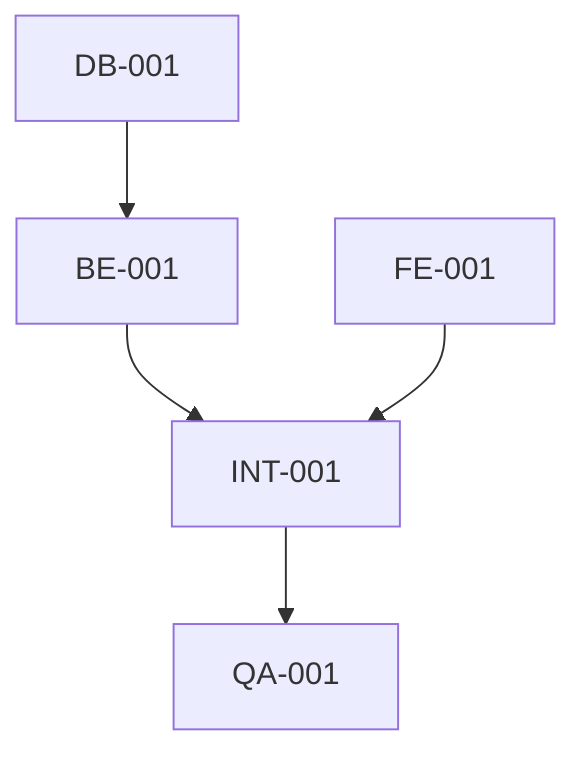

# Tasks: {{FEATURE_NAME}}

<!--
Constitution Check:
- [ ] Tasks align with approved plan
- [ ] Each task is assignable to a specialized agent
- [ ] Task types reflect principle-driven categories
-->

## Task Categories

Tasks are organized by constitution-mandated categories:

| Category | Description | Agent |
|----------|-------------|-------|
| `db` | Database schema, models, migrations | `neon-db-architect` |
| `backend` | API endpoints, business logic | `fastapi-backend-master` |
| `frontend` | UI components, pages | `frontend-visionary` |
| `integration` | Cross-layer connectivity | `integration-guardian` |
| `qa` | Testing, accessibility, polish | `qa-polish-sentinel` |
| `product` | Feature planning, UX strategy | `saas-product-architect` |

---

## Tasks

### [DB-001] {{Database Task Name}}

**Category:** `db`  
**Agent:** `neon-db-architect`  
**Status:** `pending` | `in_progress` | `completed`

**Description:**
{{Task description}}

**Acceptance Criteria:**
- [ ] Model defined with SQLModel
- [ ] Migration created with Alembic
- [ ] Indexes added where needed

---

### [BE-001] {{Backend Task Name}}

**Category:** `backend`  
**Agent:** `fastapi-backend-master`  
**Status:** `pending` | `in_progress` | `completed`

**Description:**
{{Task description}}

**Acceptance Criteria:**
- [ ] Endpoint implemented
- [ ] JWT authentication enforced
- [ ] User isolation verified
- [ ] Tests passing

---

### [FE-001] {{Frontend Task Name}}

**Category:** `frontend`  
**Agent:** `frontend-visionary`  
**Status:** `pending` | `in_progress` | `completed`

**Description:**
{{Task description}}

**Acceptance Criteria:**
- [ ] Component follows shadcn/ui patterns
- [ ] Responsive design implemented
- [ ] Dark mode supported
- [ ] Animations added with Framer Motion
- [ ] Accessibility (WCAG 2.1 AA) verified

---

### [INT-001] {{Integration Task Name}}

**Category:** `integration`  
**Agent:** `integration-guardian`  
**Status:** `pending` | `in_progress` | `completed`

**Description:**
{{Task description}}

**Acceptance Criteria:**
- [ ] Frontend-backend connectivity verified
- [ ] JWT flow working end-to-end
- [ ] CORS configured correctly
- [ ] Environment variables synchronized

---

### [QA-001] {{QA Task Name}}

**Category:** `qa`  
**Agent:** `qa-polish-sentinel`  
**Status:** `pending` | `in_progress` | `completed`

**Description:**
{{Task description}}

**Acceptance Criteria:**
- [ ] Tests generated and passing
- [ ] UX review completed
- [ ] Security checks passed
- [ ] Accessibility audit passed
- [ ] SaaS polish applied

---

## Task Dependencies

## Progress Tracking

| Category | Total | Completed | In Progress | Pending |
|----------|-------|-----------|-------------|---------|
| db | 0 | 0 | 0 | 0 |
| backend | 0 | 0 | 0 | 0 |
| frontend | 0 | 0 | 0 | 0 |
| integration | 0 | 0 | 0 | 0 |
| qa | 0 | 0 | 0 | 0 |
| **Total** | **0** | **0** | **0** | **0** |
